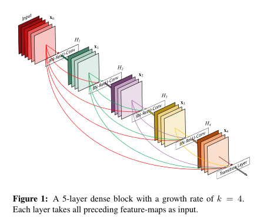

# DRINet for Medical Image Segmentation
DRINet是Dense-Res-Inception Net的缩写，顾名思义，就是集合了Dense Connection, Residual conntextion以及Inception block的特点。本文提出了一种用于医学图像分割的网络，这个网络有效的解决了随着网络层数加深准确率下降的问题，并且能提高网络的运行效率。

本文非常简单，其实就是将集中当前效果比较好的网络结构组合了一下

本文的主要贡献有：
+ 提出一种新的联合dense connection和inception structure的网络来解决分割问题。通过使用dense connection blocks、 residual inception blocks和unpooling blocks结构，在保证性能的前提下实现高效率计算
+ 简单，灵活，易于实现
+ 在图像分割任务挑战上取得了优异的表现

## 本文用到的知识

1. ResNet（深度残差网络）
2. Resdual Block
3. Bottleneck Layer
4. Inception Block
5. DenseNet
6. Inception ResNet
7. Dice coefficient

## 网络架构
.png)
与U-Net类似，DRINet由anylasis path 和 synthesis path 组成

+ 其中anylasis path类似于U-Net中的特征抽取部分，本网络使用了Dense connection blocks
+ synthesis path类似于U-Net中的图像还原部分，本网络使用residual inception blocks和 unpooling blocks

### Dense connection blocks
.png)
> 其实就是DenseNet网络中提到的Dense Block，这张图只不过是换了一种画法，比较具有迷惑性，仔细分析可以发现其与下图是相同的结构
> 

> 需要注意的是：
> 如果使用普通的卷积，那么输出的通道数通常是固定，一般为64或128。然而内存是昂贵的，因此这里使用一个1*1的卷积在每个block输出的位置，用来减少feature map的数量。在dense connection block 中，每层输出的feature map数量为ki（即growth rate），通常是12或24，这就是growth rate 超参数

使用Dense Connection Block的优点：
+ 梯度在整个网络上的传播更加有效。使用传统方法无法保证梯度在低层的的反向传播。使用dense connecgtion block可以有效减轻梯度消失的问题
+ 重用之前feature map而不是仅仅使用最后一层输出的feature map；
+ 使用growth rate 超参数可以有效的控制参数数量，调整得到更好的结果。

### Residual Inception Blocks
以下为Residual Inception Blocks的主要结构
.png)
从图中我们隐约地看到Inception Block的影子，实际上正是这样，从名字上我们也能了解各大概，这个Block是结合了Inception module和 Residual Block的特点

其中Inception module使用了三种不同的尺寸进行卷积，分别是1 * 1, 3 * 3和5 * 5，三种卷积的共同进行的。图中虽然写的是Deconvolution，但是作者是其实他们都是普通卷积，知识为了和analysis path的卷积操作进行区分。三种尺寸的卷积，接着执行连接操作（不是对应元素相加，连接操作会增加通道数）,然后使用1 * 1的卷积将通道数降低。

不同于Inception-ResNet中的Inception module有多种，本网络只是用3中尺寸的卷积核，为了减少参数数量，将5 * 5的卷积核改写成3 * 3的卷积再接上一个空洞卷积

为了进一步限制参数空间的大小，在Inception module的每一个分支使用Bottleneck结构

网络的最后将连接后卷积的结构与input做element-wise操作，等到最终的输出。
.png)

### Unpooling Blocks
上采样模块
Unpooling Blocksk可以看做是有两个分支的mini inception module。
+ 分支1：1 * 1，步长为2的deconvolution
+ 分支2：5 * 5，步长为2的deconvolution，可以替换为3*3的空洞卷积
+ 每个分支加入bottleneck layer
.png)

使用简单的上采样可能产生错误，一个小的错误可能都会被放大，使得最终结果出错。使用不同尺寸的卷积核可以减小误差。

## Evaluation Metrics
使用Dice coefficient，sensitivity，precision进行评价

