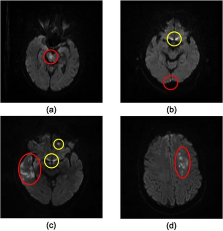
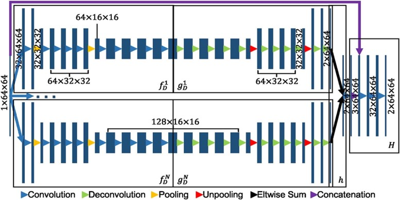
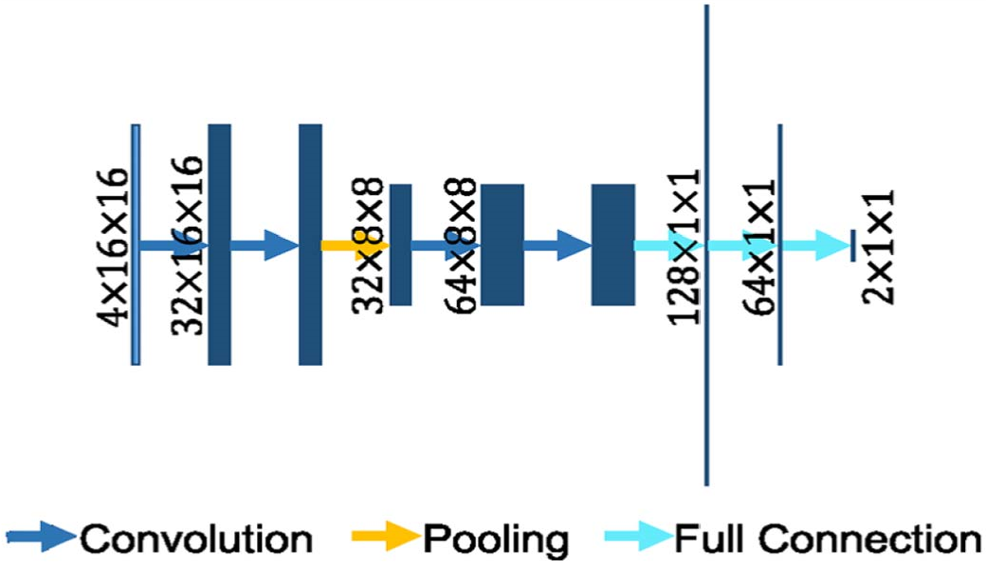
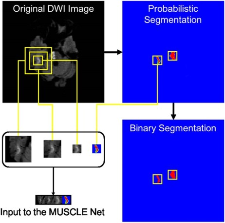

# Fully automatic acute ischemic lesion segmentation in DWI using convolutional neural networks

> DWI是指磁共振弥散加权成像
关于本网络的简述：
本网络在防止伪影上做了改进，本网络不是一个端到端的网络，使用了两个网络一个是EDD Net，另一个是MUSCLE Net。在分割步骤中使用EDD Net对DWI图像做了分割，由于病变区域有很多，可能出现假阳性的情况，于是使用MUSCLE Net对分割结果进行分类，区分出真阳性和假阳性样本。

### 普通图像分割与医学图像分割的区别
+ 在普通图像中，感兴趣的目标对象在图像中占主导地位，物体通常与背景的反差比较明显，或者有比较确定的边缘
+ 医学图像中，由于病变区域非常小，导致很容易被忽略，病变与正常组织之间的边界线难以区分，并且还存在着大量的与病变区域表现相似的伪影

> 图中红色圆圈表示急性缺血性病变，黄色圆圈代表伪影，可以看出伪影与病灶区域肉眼是很难分辨的
人工识别病变需要耗费很大的人工成本和时间成本，而目前已有的使用深度学习进行分割的方法中，大多数都存在局限性。由于它们是在仅包含数十个主题的小型数据集上开发的，然而缺血性病变可能发生在脑中的任何地方，并且存在各种形状和大小，一个小的数据集难以完全覆盖位置，形状和大小的巨大变化
目前半自动分割的方法主要有一下两种：
1. 结合空间约束的自适应阈值算法，一些小的病变区域可能在全自动自适应阈值分割中无法实现，因此引入了手动编辑以优化自动分割
2. 基于活动轮廓法，在应用算法之前，首先手动移除伪影
   
目前已有的全自动方法只能识别枕叶部位的病变

----
本文提出了一个新的框架，用来全自动的分割DWI中的中风病变区域

本框架由两个卷积神经网络组成：
1. 由N个DeconvNet集合而成的EDD Net
2. MUSCLE Net

## EDD NET
如图所示为EDD Net的结构图：

> 图中的Eltwise sum为对应元素相加
这部分集成了N个并行的DeconvNet，输入是一个图像的patch，被送到N个平行的DeconvNet中分别进行语义分割，然后将他们合并在一起，并将合并的结果与输入连接，最后添加几个卷积层产生最终的输出。
EDD Net架构的基础是DeconvNet，是一种图像分割网络。
在图像分割中，上下文信息通常为解决标签分配提供重要知识，然而，选择多少上下文最合适是很难确定的。
+ 如果背景信息过多，则会阻碍病变的识别；
+ 如果上下文不足，又无法区分伪影和真正的病变区域。
另外网络的蛇毒也影响着网络的效果
+ 如果网络变得很深，包含了很多的卷积和池化操作，虽然能够处理大量的信息，但是卷积和池化的增加也使得输入的图片被过多地下采样，由此得到的特征图分辨率较低，而有些尺寸较小的病变区域在这个过程中被消除了。这将很难被重建。
+ 如果网络很浅，即仅使用少量卷积和池化，使用的上下文也有限。在这种情况下，与病变区域具有相似性的区域（伪影）将很难区分
> 几种用于语义分割的通用CNN架构，U-Net，FCN,  Deeplab等，他们在卷积阶段有着许多的卷积层和池化层，在反卷积阶段有许多反卷积和反池化层，在每个stack中有几个卷积/反卷积层，在两个stack之间有一个池化/反池化层，stack的数量和每个stack中包含的层数决定了网络的大小
> 本网络具有3stack个卷积层和2个池化层。

EDD Net的输入是图像的patch，而不是整个图片切片，这样做有一下三个优点；
+ 改变了数据分布：对于给定图像的切片，由于局部发生急性缺血性病变，因此病变相比与代表正常组织的像素之间存在数量上的显著不平衡，代表病变的标志与整个图片的噪声和伪影标志一样弱。然而基于图像patch的数据分布，正常组织与病变区域像素数量上是基本上平衡的，因此病变的标志是明显的
+ 增加了训练数据的数量：可以从图像的切片中提取出大量的patch，如果使用图像切片作为训练数据则数据量十分有限
+ 由于图像patch比图像切片小，因此训练的batch大小可以设置得更大

使用DeconvNet作为EDD Net的基础网络，除了它的卷积层和池化层外，还有其相对应的反卷积层和反池化层，将粗糙的、低分辨率的特征图变成分割概率图

输入的图像的patch为$x$，假设$\widetilde{x}$是从卷积和池化操作获得的特征图，𝑓(⋅) 和 g(⋅) 表示卷积和反卷积函数，他们共同产生分割图 𝑦 ，则：
$$\widetilde{x}=f(x);y=g(\widetilde{x})$$

DeconvNet使用许多反卷积和反池化操作，一步步构建数据，在池化的过程中，用mask保存最大池化激活的位置

另mask为m，则：
 $$\widetilde{x},m=f_{D}(x);y=g_{D}(\widetilde{x},m)$$
其中，$g_{D}(⋅)$表示反卷积和反池化操作，利用池化得到的mask重建图像

使用N个DeconvNet集成的一组分类器，可以进一步提升分割结果的精确度。

另$h{X}$表示融合N个网络的集成方法，则：
$$h(x)=g_{D}^{1}(f_{d}^{1}(x)) \oplus g_{D}^{2}(f_{d}^{2}(x)) \oplus ⋅⋅⋅ \oplus g_{D}^{N}(f_{d}^{N}(x))$$

因为N个DeconvNet的初始化不同，他们会聚集在不同的最佳状态，但所有的子网络都能产生准确的病变分割。因此，CNN的集成因为他们的准确性和多样性使整个网络的性能提高

此外，受U-Net的启发，本文在原生的集成的输出层后又增加了额外的卷积和来细化分割。

由于原始的输入图片会在多次的卷积池化、反卷积和反池化中丢失掉一些细节信息，所以将输出图片与集成网络的语义分割结果连接起来，在添加一些额外的卷积层，以便可以根据原始图像细化分割，经过试验证明，细化过后性能略有提高。

$$H(x)=r(h(x),x)$$
其中𝑟(⋅,⋅)代表连接和卷积，因此EDD Net的损失函数为：
$$l = \lambda_{1}(l_{1}(H(x),y))+\lambda_{2}(l_{2}(H(x),y))+\lambda_{3}(l_{3}(g_{D}^{1}(f_{D}^{1}(x))))+\lambda_{4}(l_{4}(g_{D}^{2}(f_{D}^{2}(x))))+⋅⋅⋅+\lambda_{N+2}(l_{N+2}(g_{D}^{N}(f_{D}^{N}(x))))$$
>其中损失函数$l_{i},i=(1,2,3,...,N+2)$是cross-entropy交叉熵损失函数，$\lambda_{i}$是相应的权重，损失函数通过反向传播进行优化。
> 另外，EDD Net是全卷积网络，所有的子网络狗屎卷积网络，因此输入的尺寸是可变的
> 该网络使用图像的patch进行训练，但测试时用的是整张图像切片

## MUSCLE Net
MUSCLE Net是multiscale convolutional label evaluation net 的缩写，即多尺度卷积标签评价网络

EDD Net准确的识别出急性缺血性病变，然而不可避免的产生许多假阳性簇（伪影）。它们与小尺寸的病变具有相似的外观，为了消除它们，本文使用了MUSCLE Net这个网络，它能评价EDD网络检测到的病变区域，来区分假阳性和真阳性。

如图所示为MUSCLE Net的基本结构。输入是从原始的DWI提取的三个尺度的图像patch以及EDD网络分割得到的概率图。MUSCLE Net 能评估候选区域是否是真正的病变区域，考虑到输入的patch非常小，MUSCLE Net的卷积层数设置很小。

整个MUSCLE Net有四个卷积层，一个池化层和三个全连接层，其架构来自于mini VGG Net。卷积层用来抽取特征，全连接层用来分类。

EDD Net输出的概率图经过余志华得到了二元分割图（预测的区域是1，背景是0）。候选的病变区域基于这个二元分割图，使用连通区域分析得到

在他们的周围提取出多个尺度的原始图片和由EDD Net生成的对应的概率图patch作为MUSCLE Net的输入

其中将真正的病变区域标记为阳性，伪影标记为阴性

MUSCLE Net的输出结果是实例级的，而不是像素级的，相当于对这个图片的内容进行分类，然后利用贝叶斯公式与EDD Net的输出概率计算得到最后的分割概率图

> 设事件$P(A)$为某一像素点为EDD Net判断为阳性的概率，$P(\widetilde{A})$为某一像素点为EDD Net判断为阴性的概率，事件P($B$\lvert A)为在A事件成立的条件下是真病变区域的概率，$P(\widetilde{B} \lvert A)$为在A事件成立的条件下为伪影的概率，$P(B)$为真实情况下为真病变区域的概率，$P(\widetilde{B})$为真实情况下为伪影的概率的概率，根据贝叶斯公式求$P(B)$和$P(\widetilde{B})$。

## 评价方法
采用Dice Coefficient来比较分割结果与ground truth是否一致
$$𝐷ice(𝑥,𝑦)=\frac{2|𝑥∩𝑦|}{(|𝑥|+|𝑦| )}$$
基于重叠的相似性度量方法不是在所有的情况下都是鲁棒的。如果ground truth包含数百的像素，则一个像素的误差不会显著地影响Dice系数；如果ground truth只包含几个像素，那么一个像素的误差将会对Dice系数产生显著的影响。由于病变区域普遍不大，因此本文提出了一种新的评价标准，引入了以下参数：
+ FP：表示假阳性
+ FN：表示假阴性
+ m#：平均数
+ mS：平均像素大小
+ 我们的目标是减小FP和FN的大小和数值
+ 检测率𝐷𝑅=𝑁_𝑇𝑃/𝑁
+ 其中𝑁表示所有所有候选区域的数量，𝑁_𝑇𝑃表示候选区域为TP的数量

## 实验细节
使用随机梯度下降算法实现训练期间的优化，学习率固定为0.5，动量和权重衰减分别为0.9和0。使用Xavier算法初始化网络中的权重，卷积核与反卷积核的尺寸是3*3，步长为1，使用BN。设置N=2，𝜆_𝑖=1（𝑖=1,2,…,𝑁+2）

## 数据预处理
有来自741名急性中分患者的DWI数据，其中用作训练和验证集有380个，其中274用来做训练集，106用来做验证集，其余361个样本做测试集

由于是从不同的扫描仪得到的图像，因此需要对图像进行预处理。不同图像在Z轴上是不同的，而对Z轴重采样可能引入差值误差，因此本网络只用2D切片作为输入数据，而不是3D立方体。为了确保2D切片中每个像素具有一致的物理像素尺寸，在2D切片中执行线性均匀重采样。所有的图片都重采样为像素尺寸为1.6mm×1.6mm大小。

之后对每个图片进行均值为0，方差为1的归一化处理

## 数据集扩充
对提取的图片patch进行水平翻转，并随机旋转
Patch的提取策略：
+ 对标记为病变部分的所有像素进行提取，对每个像素，提取它周围的像素形成一个patch，该像素位于patch中的随机位置。因此，每个patch可能既包含病变像素又包含背景像素。如果病变很大，像素落在病变区域中心，那么这个patch将仅包含病变的像素。
+ 病变区域的像素通常有多个（如20个），那个就可以产生20个patch。

## 实验
实验部分比较好理解

亮点：
1. 将分类网络引入图像分割中
2. 网络的集成
3. 评价指标的设计

