# CNN 图像分割中一些常见的知识点整理
## 残差结构
残差结构的概念来自Deep Residual Learning for Image Recognition这篇文章。首先来介绍一下这篇文章。
网络深度的重要性：
因为CNN能够提取low/mid/high-level的特征，网络的层数越多，意味着能够提取到不同level的特征越丰富。并且，越深的网络提取的特征越抽象，越具有语义信息。
我们认为是随着网络层数的加深，网络越来越复杂，而复杂的网络更有利于特征的抽取，因此能够达到更好的效果。而实际情况并不是这样，对于原来的网络，如果简单地增加深度，会导致梯度弥散或梯度爆炸。

> 对于该问题的解决方法是使用正则化初始化和中间正则化层（Batch Normalizetion）,这样可以训练几十层的网络。

而现在却出现另一个问题，就是退化问题。不同于过拟合，过拟合的情况是在训练集下的效果很好，而在测试集上的效果不好，但是目前的情况是即使在测试集上的准确率也会随着层数的加深降低。

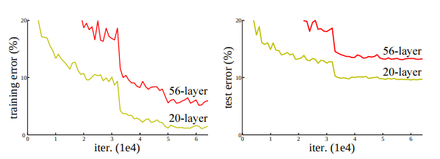

如图所示，有两个不同深度的网络一个是56层，另一个是20层，我们可以看出，随着层数的增多，不论是训练集还是测试及，误差error都在增大，这就是退化现象。

吴恩达的课程长一张图也可以说明

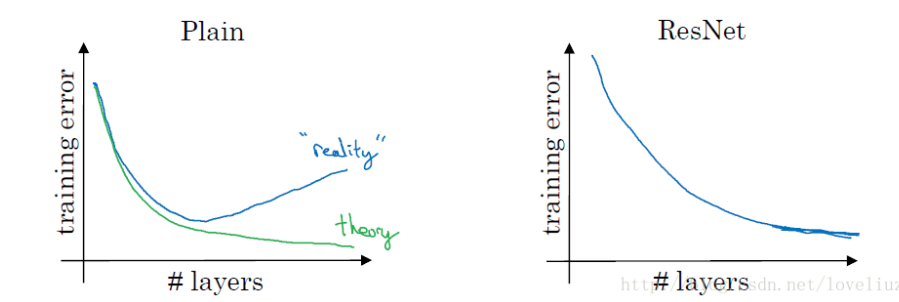
### Residual block的主要结构（残差块）
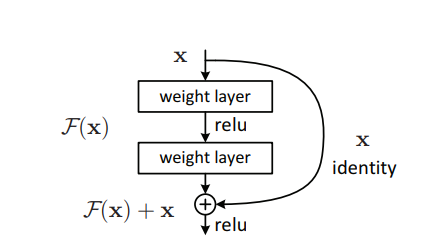

上图是一个Residual block结构，我们可以看到有一个x跳过了一层卷积层，这个就是一个shortcut connection。假设residual mappting（残差映射）为$H(x)$，而我们让非线性的映射表示为$F(x)=H(x)-x$，$x$则为identity mappting（恒等映射），则$H(x)=F(x)+x$。我们认为，残差映射要比传统的映射更好优化，因为当极端条件下，当非线性映射为0时，即$F(x) =0$，实质上就是恒等映射。在通常情况下，要使一个网络的一些层去拟合一个恒等映射是很复杂的，这可能就是退化的原因，但是我们可以转化为学一个残差是$F(x)=H(x)-x=0$，实质上就是一个恒等映射$H(x)=x$。拟合残差可能比拟合恒等更加容易。

> 一些其他的解释
> F是求和前网络映射，H是从输入到求和后的网络映射。比如把5映射到5.1，那么引入残差前是$F'(5)=5.1$，引入残差后是$H(5)=5.1$, $H(5)=F(5)+5$, $F(5)=0.1$。这里的$F'$和$F$都表示网络参数映射，引入残差后的映射对输出的变化更敏感。比如$s$输出从5.1变到5.2，映射$F'$的输出增加了1/51=2%，而对于残差结构输出从5.1到5.2，映射$F$是从0.1到0.2，增加了100%。明显后者输出变化对权重的调整作用更大，所以效果更好。残差的思想都是去掉相同的主体部分，从而突出微小的变化，看到残差网络我第一反应就是差分放大器
> 至于为何shortcut的输入时X，而不是X/2或是其他形式，文章的作者又做了其他的实验如下图所示
> 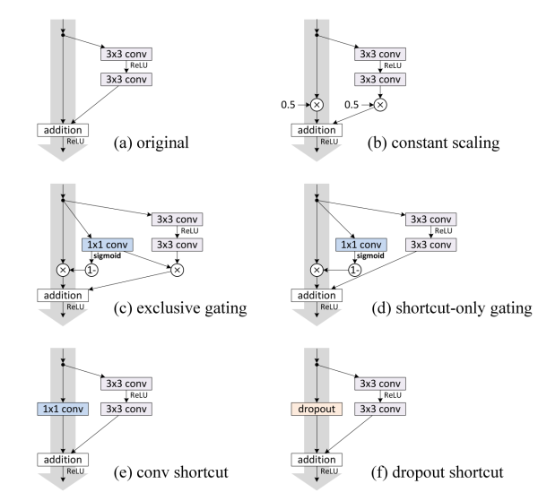
> 实验的结果发现使用X的效果更好
> 有一种更好理解的方法说明残差网络更容易训练，其实还是这个shortcut，也可以称作skip connection。当他收到某一层传来的梯度后，因为是从之前很早的层直接连接过来的，因此梯度可以直接传过去。

这种残差结构可以通过前向神经网络+shortcut连接实现。而其shortcut连接相当于简单执行了同等映射，不会产生额外的参数，也不会增加计算的复杂度。而且，这个网络可以依旧通过端到端的反响传播进行训练。

ResNet提出了两种残差单元

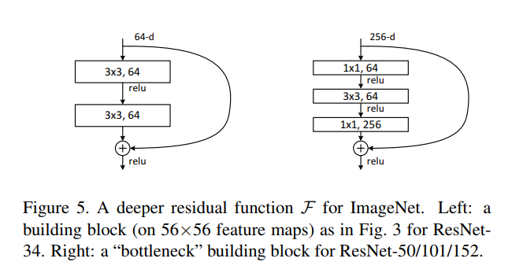

其中作图被用在ResNet-34而右图被用在ResNet-50/101/152网络中。在左图网络中通道书比较少，在右图网络中通道数比较大。如果通道数比较大，那么用左图的残差结构就会产生几何级倍数的参数数量，因此可以先用1\*1的卷积将通道数降下来，完成卷积操作后再用1\*1的卷积恢复到原来的通道数，这样的结构成为bottleneck layer。
现在假设一个通道数为256的网络，通过一个残差结构，通过一个残差结构，如果不是用bottlenect那么参数的数量为$3*3*256*256*2=1179648$，而使用了bottleneck的参数数量为$1*1*256*64+3*3*64*64+1*1*64*256=69632$

如果$F(x)$与x的通道数不同怎么办？
+ 如果通道数相同，则$y=F(x)\oplus x$
+ 通道数不同，则$y=F(x)\oplus Wx$，其中$W$为卷积操作，用来调整通道数（1*1的卷积）

shortcut connection的优点：
+ 减轻了梯度弥散的问题，有利于训练更快收敛，因为梯度可以直接先前传递
+ 加强了特征的重用和传递
+ 减少参数

数学证明：
https://blog.csdn.net/u013709270/article/details/78838875

## Inception Module
Imception Mudule最早是在[Going deeper with convolutions](https://arxiv.org/abs/1409.4842)一文中提出的结构，基本思想是不需要人为决定使用哪种过滤器或是否需要池化，而由网络自行确定。我们需要做的是给网络传入这些待选的参数（如$1*1，3*3，5*5$， maxpooling），然后把输出连接起来，让网络自己学需要什么样的参数或哪些参数的组合。

inception结构有多个版本

### inception v1

在这篇文章中，作者提出了目前图像分割主要面临的问题：
1. **由于信息位置的巨大差异，为卷积操作选择合适的卷积核大小就比较困难**。信息分布更全局性的图像偏好较大的卷积核，信息分布比较局部的图像偏好较小的卷积核。
2. 非常深的网络更容易过拟合，将梯度更新传输到整个网络是很困难的。
3. 简单地堆叠较大的卷积层非常消耗计算资源。

为了解决这些存在的问题，提出了inception结构作为解决方案：

下图是最初的Inception结构

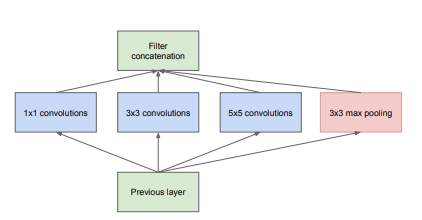

使用了三个不同大小的滤波器（$１×１,３×３,５×５$）对输入执行卷积操作，此外，他还会执行最大池化。所有子层的输出最后会被级联起来，并传送至下一个inception block。
> 采用不同大小的卷积核意味着不同大小的感受野，最后拼接以为只不同尺度特征的融合
> 之所以采用1，3和5，主要是为了方便对齐。设定军妓补偿stride=1之后，只要分别设定padding=0,1,2，那么卷积之后便可以得到相同维度的特征，然后这些特征就可以拼接在一起了
> 由于池化操作对于当前卷积网络的性能至关重要，因此建议在每个incepition 模块中都添加一个并行的池化层。
> 随着inception 模块的叠加，与他们的输出相关的统计数据也会发生变化：随着更高层次捕获更好层次的特征，他们的空间浓度也会下降，这表明在高层的网络应该增加$3*3和5*5$的数量。
> 即使在上面的结构中，使用$5*5$的卷积核也是十分昂贵的，加入了池化层，这种问题更加明显：他们输出的过滤器的数量等与前一阶段过滤器的数量。池化层的输出与卷基层的输出合并将不可避免地增加输出的数量。

由此出现了下面的一种inception模块。

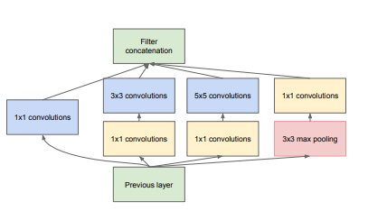

由于传统的卷积神经网络需要消耗大量的计算资源。为了降低算力成本，作者在$3*3和5*5$卷积层之前添加额外的$1*1$卷积层，来限制输入信道的数量，这样做可以极大地减少参数空间大小，有利于降低算力成本。
> 1*1的卷积在池化层之后，而不是之前

### ！inception计算代价的计算代价：
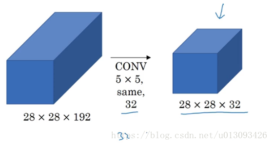

使用这种结构，我们需要计算的参数数量为$5*5*192*28*28*32=120422400$

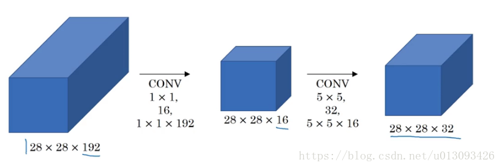

使用这种结构，我们需要计算的参数数量为$1*1*192*28*28*16+5*5*16*28*28*32=12443648$

我们可以清楚的看到参数数量少了一个数量级

----
### Inception v2
inception v2出自论文[Rethinking the Inception Architecture for Computer Vision](https://arxiv.org/pdf/1512.00567v3.pdf)

inception v2是学习了两个VGG用两个$3*3$的卷积代替一个$5*5$的卷积，此时构建更深的网络逐渐成为主流，但是模型的变大也使得计算效率越来越低，文章师徒找到一种方法在扩大网络的同事有尽可能地发挥计算性能。

改进方法
+ 将 5×5 的卷积分解为两个 3×3 的卷积运算以提升计算速度。尽管这有点违反直觉，但一个 5×5 的卷积在计算成本上是一个 3×3 卷积的 2.78 倍。所以叠加两个 3×3 卷积实际上在性能上会有所提升，如图所示：
    + 将全连接的$5*5$的卷积分解，发现它很像两个全连接的$3*3$的卷积
    + 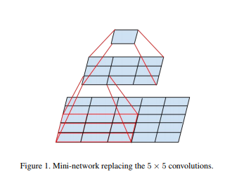    
    + 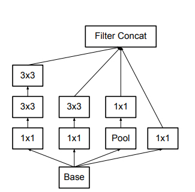
    > 在两个 3×3 的卷积和后使用非线性激活还可一提高性能
+ 任何尺寸大于$3*3$的卷积和够可以改写成多个$3*3$的卷积，我们是否可以将$3*3$变得更小？答案是肯定的，但是文章作者发现$2*2$的对称卷积核效果不如给对称卷积核，如n×1。事实上，我们可以认为，可以用1×n的卷积核替换任何n×n的卷积和。将$n*n$ 的卷积核尺寸分解为 1×n 和 n×1 两个卷积。一个 3×3 的卷积等价于首先执行一个 1×3 的卷积再执行一个 3×1 的卷积。这种方法在成本上要比单个 3×3 的卷积降低 33%，如图所示：
    + 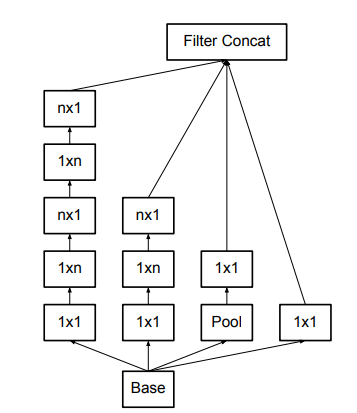
    > 任意的 $n*n$ 的卷积都可以通过1xn卷积后接nx1卷积来替代。实际上，作者发现在网络的前期使用这种分解效果并不好，还有在中度大小的feature map上使用效果才会更好。feature map（$m*m$）的大小，m在12到20之间。
    > 另外还有一种将$1*n$与$n*1$并联的设计，如下图所示
    > 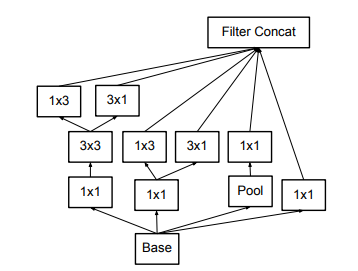
+ 注意representational bottlenecks问题

### Inception v3
辅助分类器的产生最初的目的是将有用的梯度直接先底层传送，是这题梯度可以被立即使用，并且通过在非常深的网络中消除小时梯度问题来改善训练期间的收敛性。然而本文作者发现，辅助分类器在训练早期并未有使收敛性得到改善，带不带辅助分类器的网络的效果差异不大，但是在训练过程快结束时，带有辅助分类器的网路性能开始超过不带辅助分类器的网络。另外，当去掉底层的辅助分类器，发现性能并没有多少改善，因此作文认为之前提到的辅助分类器可以更好地将参数传递给底层的假设是错误的。相反，可以认为辅助分类器可以充当正则化器。

Inception v3在v2的基础上：
+ RMSProp 优化器；
+ Factorized 7x7 卷积；
+ 辅助分类器使用了 BatchNorm；
+ 标签平滑（添加到损失公式的一种正则化项，旨在阻止网络对某一类别过分自信，即阻止过拟合）。

## 辅助分类器(Auxiliary Classifier)
Going deeper with convolutions一文中提出。在创建GoogLeNet是，为了在深度较深的网络中增强梯度像所有层传播的能力。

## Batch Normailzation
Batch Normailzation这个概念是Batch Normalization: Accelerating Deep Network Training by  Reducing Internal Covariate Shift这篇文章提出的，目前这个算法已经被大量应用图像分割领域，许多方法的网络结构中都是用了它。

尽管随机梯度下降法对于训练深度网络简单高效，但是它有个毛病，就是需要我们人为的去选择参数，比如学习率、参数初始化、权重衰减系数、Drop out比例等。这些参数的选择对训练结果至关重要，以至于我们很多时间都浪费在这些的调参上。

由于最初的Inception某块友谊写

Batch Normalization的强大指出有以下几点：
+ 你可以选择比较大的初始学习率，让你的训练速度飙涨。以前还需要慢慢调整学习率，甚至在网络训练到一半的时候，还需要想着学习率进一步调小的比例选择多少比较合适，现在我们可以采用初始很大的学习率，然后学习率的衰减速度也很大，因为这个算法收敛很快。当然这个算法即使你选择了较小的学习率，也比以前的收敛速度快，因为它具有快速训练收敛的特性；
+ 你再也不用去理会过拟合中dropout、L2正则项参数的选择问题，采用BN算法后，你可以移除这两项了参数，或者可以选择更小的L2正则约束参数了，因为BN具有提高网络泛化能力的特性；
+ 

1. xception
2. deconvolution
3. 空洞卷积
4. skip connection
5. dropout
6. full convolution
7.  bottleneck layer
8.  uppooling
9.  辅助分支
10. feature map
11. CT值阶段
12. dice Coefficient
13. 假阳性
14. 平衡像素值
15. pooling mask
16. 连通区域分析
17. 蒸馏法
18. 正则化器。
19. representational bottlenecks
